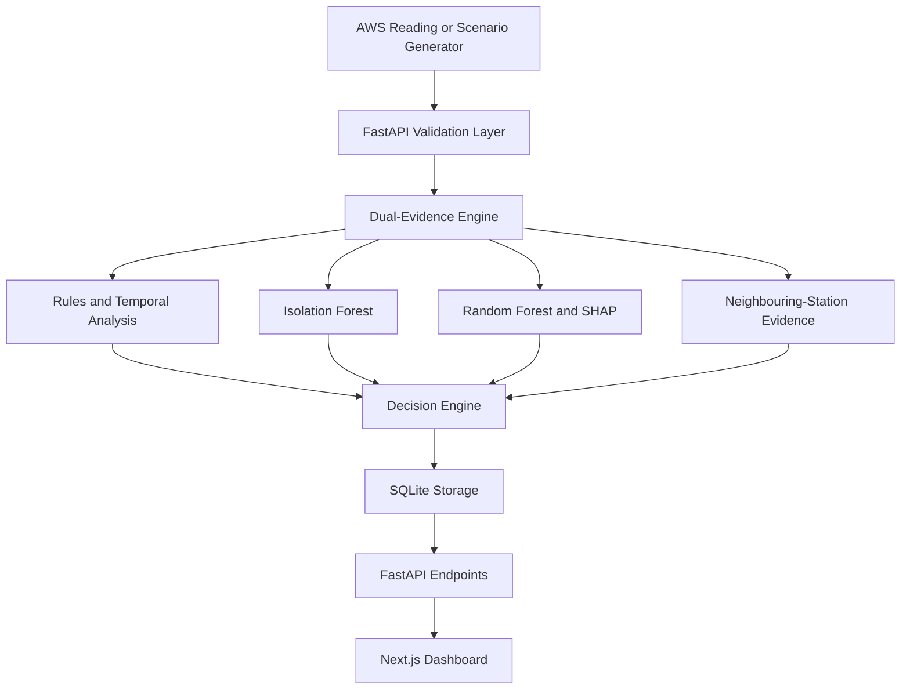

# SkyGuard AI

### Intelligent Real-Time Anomaly Detection for Automatic Weather Stations

**Team NABHSANKET · SIH Problem Statement 26073 · Hackathon Prototype**

SkyGuard AI is an AI-assisted weather-station monitoring system designed to distinguish between:

- Genuine meteorological events
- Sensor or data faults
- Normal weather conditions
- Uncertain cases requiring human review

The system monitors temperature, atmospheric pressure, and relative humidity readings from Automatic Weather Stations (AWS). It combines machine learning, physical validation rules, temporal analysis, and neighbouring-station evidence to reduce false alarms.

> **Prototype disclosure:** The current version uses simulated stations and physics-guided synthetic training and demonstration data. It is not currently connected to live IMD or NOAA services and must not be treated as an operational weather-warning system.

---

## Problem Statement

Automatic Weather Stations can produce incorrect observations because of:

- Sensor malfunction
- Calibration drift
- Frozen sensors
- Sudden data spikes
- Communication failures
- Missing readings
- Timestamp errors
- Power fluctuations
- Environmental damage
- Data corruption

A large temperature change could represent either a genuine heatwave or a faulty temperature sensor. SkyGuard AI evaluates several types of evidence before making that decision.

---

## Core Decisions

Every reading receives one of four classifications:

1. `Normal`
2. `Genuine Weather Event`
3. `Sensor/Data Fault`
4. `Uncertain - Human Review`

The system also provides:

- Confidence score
- Anomaly score
- Severity
- Human-readable explanation
- Triggered validation rules
- Suggested corrected value where appropriate
- Sensor-health information
- Feature contribution information using SHAP

---

## Key Features

- Live monitoring dashboard
- Five simulated AWS stations
- Temperature, pressure, and humidity monitoring
- Hybrid Dual-Evidence Engine
- Isolation Forest anomaly detection
- Random Forest classification
- Physical range and consistency checks
- Temporal spike, drift, flatline, noise, and dropout detection
- Neighbouring-station comparison
- SHAP-based model explanations
- Station coordinate map
- Station-specific historical charts
- Alert feed with severity and confidence
- Sensor-health monitoring
- Scenario Lab with ten demonstration scenarios
- Model Insights dashboard
- Downloadable CSV reports
- Session-based maintenance planner
- Backend connection and system-status page
- SQLite data persistence
- FastAPI Swagger documentation
- Automated backend tests
- Responsive Next.js interface

---

## System Architecture



### Processing Flow

1. A weather reading enters the FastAPI backend.
2. Pydantic validates the station ID, timestamp, and sensor values.
3. Physical rules check impossible or suspicious values.
4. Temporal analysis checks recent readings for spikes, flatlines, drift, noise, and gaps.
5. Isolation Forest evaluates whether the reading behaves like an outlier.
6. Random Forest evaluates the most likely classification.
7. Nearby station readings provide regional weather evidence.
8. The Decision Engine combines the evidence.
9. SHAP identifies influential model features.
10. The raw reading, decision, explanation, and health information are stored in SQLite.
11. The frontend retrieves the result through REST API endpoints.

---

## Dual-Evidence Approach

SkyGuard AI separates evidence into two major groups.

### Meteorological Evidence

This evidence suggests that a change may be a genuine weather event:

- Similar changes across neighbouring stations
- Physically consistent relationships between variables
- Regional temperature or pressure movement
- Gradual weather-related changes
- Values remaining within plausible meteorological ranges

### Sensor-Fault Evidence

This evidence suggests that the observation may be faulty:

- A change affecting only one station
- Physically impossible values
- Frozen or repeated readings
- Sudden isolated spikes
- Gradual calibration drift
- Excessive random noise
- Missing data
- Invalid or delayed timestamps

The final decision is based on the combined evidence rather than one fixed threshold.

---

## Technology Stack

| Layer | Technology | Purpose |
|---|---|---|
| Frontend | Next.js 16 | Dashboard and application routing |
| UI | React 19 and TypeScript | Typed interactive interface |
| Styling | Tailwind CSS | Responsive visual design |
| State management | Zustand | Shared frontend state |
| Charts | Recharts | Weather and model visualisations |
| Animation | Framer Motion | Interface transitions |
| Backend | FastAPI | REST API and application logic |
| Validation | Pydantic | Request and response validation |
| Database | SQLite and SQLAlchemy | Local persistent storage |
| Machine learning | scikit-learn | Isolation Forest and Random Forest |
| Explainability | SHAP | Model feature contributions |
| Data processing | NumPy and pandas | Data preparation and evaluation |
| Testing | pytest and HTTPX | Backend engine and API tests |

---

## Demonstration Stations

The prototype contains five clearly labelled simulated stations.

| Station ID | Station name |
|---|---|
| `SIM_KOLKATA_01` | Kolkata Central Demo AWS |
| `SIM_HOWRAH_02` | Howrah Demo AWS |
| `SIM_BARASAT_03` | Barasat Demo AWS |
| `SIM_SONARPUR_04` | Sonarpur Demo AWS |
| `SIM_KALYANI_05` | Kalyani Demo AWS |

Their coordinates represent demonstration locations in West Bengal. They are not live IMD stations.

---

## Project Structure

```text
SkyGuard-AI/
├── backend/
│   ├── main.py
│   ├── ml_engine.py
│   ├── scenario_generator.py
│   ├── simulate_stream.py
│   ├── services.py
│   ├── database.py
│   ├── models.py
│   ├── schemas.py
│   ├── seed.py
│   ├── config.py
│   ├── evaluate_model.py
│   ├── requirements.txt
│   ├── PROJECT_WALKTHROUGH.md
│   └── tests/
├── frontend/
│   ├── src/app/
│   ├── src/components/
│   ├── src/lib/
│   ├── src/store/
│   ├── package.json
│   └── next.config.ts
├── .gitignore
└── README.md
```

---

## Prerequisites

Install the following software:

- Python 3.11
- Node.js
- npm
- Git
- Visual Studio Code or another code editor

---

## Local Installation

### 1. Clone the repository

```powershell
git clone https://github.com/duttakritika07-web/SkyGuard-AI.git
cd SkyGuard-AI
```

### 2. Set up the backend

Open a PowerShell terminal in the project folder:

```powershell
cd backend
```

Create the Python virtual environment:

```powershell
py -3.11 -m venv venv
```

Upgrade pip:

```powershell
venv\Scripts\python.exe -m pip install --upgrade pip
```

Install the backend packages:

```powershell
venv\Scripts\python.exe -m pip install -r requirements.txt
```

Start the backend:

```powershell
venv\Scripts\python.exe -m uvicorn main:app --reload --port 8000
```

The backend will be available at:

- API home: <http://127.0.0.1:8000>
- Swagger documentation: <http://127.0.0.1:8000/docs>
- Health endpoint: <http://127.0.0.1:8000/health>

Keep this terminal running.

### 3. Set up the frontend

Open a second PowerShell terminal from the main project folder:

```powershell
cd frontend
```

Install the exact frontend dependencies:

```powershell
npm ci
```

Create a file named `.env.local` inside the `frontend` folder:

```env
NEXT_PUBLIC_API_URL=http://127.0.0.1:8000
```

Start the frontend:

```powershell
npm run dev
```

Open the dashboard:

<http://localhost:3000>

---

## Application Pages

| Route | Purpose |
|---|---|
| `/` | Main monitoring dashboard |
| `/stations` | Station list and coordinate map |
| `/stations/[id/[id]` | Individual station analysis |
| `/alerts` | Anomaly and weather-event alerts |
| `/maintenance` | Sensor health and session maintenance planner |
| `/simulation` | Backend-powered Scenario Lab |
| `/model-insights` | Model details, features, and evaluation information |
| `/reports` | CSV data exports |
| `/settings` | Backend and system status |

---

## Scenario Lab

SkyGuard AI includes ten repeatable demonstration scenarios.

| Scenario | Expected final classification |
|---|---|
| `normal` | Normal |
| `regional_storm` | Genuine Weather Event |
| `regional_heatwave` | Genuine Weather Event |
| `temperature_spike` | Sensor/Data Fault |
| `frozen_sensor` | Sensor/Data Fault |
| `gradual_drift` | Sensor/Data Fault |
| `dropout` | Sensor/Data Fault |
| `noise_burst` | Sensor/Data Fault |
| `timestamp_error` | Sensor/Data Fault |
| `ambiguous_change` | Uncertain - Human Review target |

The easiest demonstration method is:

1. Start the backend.
2. Start the frontend.
3. Open **Scenario Lab** from the sidebar.
4. Select a scenario.
5. Run the scenario.
6. Inspect the result on the dashboard, station page, alert page, and sensor-health page.

Scenario labels are stored for demonstration and auditing only. They are not provided to the machine-learning models as input features.

---

## API Endpoints

| Method | Endpoint | Purpose |
|---|---|---|
| `GET` | `/` | Backend information |
| `GET` | `/health` | API, model, and database health |
| `GET` | `/model-info` | Model features and prototype metrics |
| `GET` | `/stations` | Station metadata |
| `GET` | `/snapshots` | Combined station dashboard data |
| `GET` | `/readings/latest` | Latest readings |
| `GET` | `/readings/history/{station_id}` | Station reading history |
| `GET` | `/alerts` | Non-normal classifications |
| `GET` | `/station-health` | Health of all stations |
| `GET` | `/station-health/{station_id}` | Health of one station |
| `GET` | `/demo/scenarios` | Available demonstration scenarios |
| `POST` | `/predict` | Process one reading |
| `POST` | `/predict/batch` | Process a batch of readings |
| `POST` | `/demo/scenarios/{scenario_name}` | Run a complete scenario |

All endpoints can be inspected and tested through Swagger at:

<http://127.0.0.1:8000/docs>

---

## Example Prediction Request

Send the following JSON body to `POST /predict`:

```json
{
  "station_id": "SIM_KOLKATA_01",
  "temperature": 29.2,
  "pressure": 1011.4,
  "humidity": 64.5,
  "scenario_label": "manual_test",
  "is_simulated": true
}
```

The timestamp is optional. When it is omitted, the backend uses the current UTC time.

---

## Verification

### Backend tests

From the `backend` folder:

```powershell
venv\Scripts\python.exe -m pytest -q
```

### Model evaluation

```powershell
venv\Scripts\python.exe evaluate_model.py
```

The displayed accuracy and F1 results represent synthetic holdout performance. They are not real IMD field-performance claims.

### Frontend lint check

From the `frontend` folder:

```powershell
npm run lint
```

### Frontend production build

```powershell
npm run build
```

---

## Data and Model Transparency

The current prototype uses:

- Physics-guided synthetic training patterns
- Simulated station readings
- Explicit demonstration scenarios
- Generated normal, weather-event, and sensor-fault patterns

The current prototype does **not** use:

- Live IMD station readings
- Live NOAA data
- A live Kaggle dataset connection
- Operational disaster-warning feeds
- Field-certified sensor calibration data

Real historical NOAA, IMD, or verified AWS datasets can be added during the validation phase. A final scientific evaluation should use time-aware and station-aware dataset splits so that readings from the same event do not leak into both training and testing data.

---

## Current Limitations

- Training and demonstration data are synthetic.
- SQLite is intended for prototype-scale local storage.
- The Maintenance Planner is session-only and resets when the page reloads.
- Alert workflow actions are not yet persisted for multiple users.
- Email and SMS notifications are not implemented.
- Authentication and role-based access are not implemented.
- ESP32 edge deployment is a future extension.
- The project has not been validated for operational weather warnings.
- Large-scale deployment and real-station testing remain future work.

---

## Future Development

- Integrate verified historical IMD or NOAA weather data
- Evaluate with station-aware and time-aware validation
- Measure false-alarm and missed-event rates
- Add live MQTT or AWS data ingestion
- Add authenticated user roles
- Persist maintenance and alert workflows
- Add email, SMS, or webhook notifications
- Migrate from SQLite for large deployments
- Containerise the application using Docker
- Deploy the frontend and backend securely
- Optimise a lightweight model for ESP32 or edge gateways
- Conduct pilot testing with real Automatic Weather Stations

---

## Responsible Use

SkyGuard AI is a decision-support prototype. High-impact meteorological and maintenance decisions must remain under qualified human supervision. Raw observations are preserved separately from suggested corrected values to maintain auditability.

---

## Team

**Team NABHSANKET**

Smart India Hackathon  
Problem Statement ID: **26073**

**Project:** SkyGuard AI  
**Focus:** Intelligent anomaly detection and sensor-health monitoring for Automatic Weather Stations