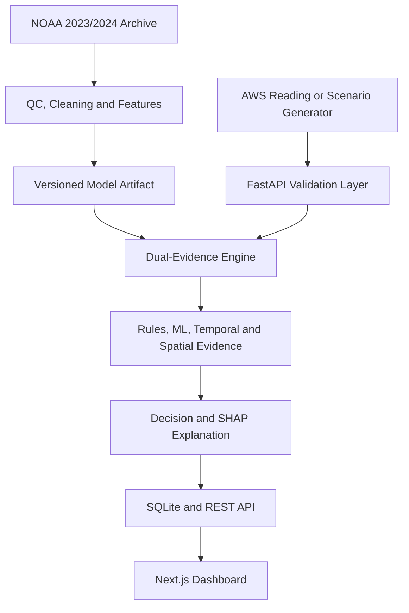

# SkyGuard AI

### Intelligent Real-Time Anomaly Detection for Automatic Weather Stations

**Team NABHSANKET · SIH Problem Statement 26073 · Hackathon Prototype**

SkyGuard AI is an AI-assisted weather-station monitoring system designed to distinguish between:

- Genuine meteorological events
- Sensor or data faults
- Normal weather conditions
- Uncertain cases requiring human review

The system monitors temperature, atmospheric pressure, and relative humidity readings from Automatic Weather Stations (AWS). It combines machine learning, physical validation rules, temporal analysis, and neighbouring-station evidence to reduce false alarms.

> **Prototype disclosure:** The runtime dashboard uses five simulated stations for repeatable demonstrations. The active ML artifact is trained with quality-controlled historical NOAA NCEI observations from five West Bengal stations (2023 training, 2024 time-separated evaluation) plus clearly identified controlled weather/fault transformations. It does not use live IMD or live NOAA feeds and must not be treated as an operational weather-warning system.

## Current Verified Status

| Item | Result |
|---|---:|
| Real NOAA 2023 observations | 10,685 rows |
| Real held-out NOAA 2024 observations | 10,335 rows |
| Historical stations | 5 |
| Model features | 15 |
| Controlled benchmark accuracy | 98.13% |
| Controlled benchmark Macro F1 | 98.13% |
| Backend tests | 5 passed |
| Demonstration scenarios | 10/10 expected decisions |
| Frontend verification | ESLint and production build passed |

The accuracy and Macro F1 values describe a controlled benchmark, not field-certified operational accuracy. See the [NOAA Historical Model Card](backend/NOAA_MODEL_CARD.md) for data provenance, station IDs, methodology, confusion matrix, limitations, and reproduction commands.

---

## Problem Statement

Automatic Weather Stations can produce incorrect observations because of:

- Sensor malfunction
- Calibration drift
- Frozen sensors
- Sudden data spikes
- Communication failures
- Missing readings
- Timestamp errors
- Power fluctuations
- Environmental damage
- Data corruption

A large temperature change could represent either a genuine heatwave or a faulty temperature sensor. SkyGuard AI evaluates several types of evidence before making that decision.

---

## Core Decisions

Every reading receives one of four classifications:

1. `Normal`
2. `Genuine Weather Event`
3. `Sensor/Data Fault`
4. `Uncertain - Human Review`

The system also provides:

- Confidence score
- Anomaly score
- Severity
- Human-readable explanation
- Triggered validation rules
- Suggested corrected value where appropriate
- Sensor-health information
- Feature contribution information using SHAP

---

## Key Features

- Live monitoring dashboard
- Five simulated AWS stations
- Temperature, pressure, and humidity monitoring
- Hybrid Dual-Evidence Engine
- Isolation Forest fitted on balanced historical NOAA 2023 observations
- Random Forest classification using real baselines and controlled transformations
- Time-separated 2024 evaluation to reduce temporal leakage
- Reproducible NOAA downloader, cleaner, feature pipeline, and training script
- Automatic synthetic fallback if the historical model artifact is unavailable
- Physical range and consistency checks
- Temporal spike, drift, flatline, noise, and dropout detection
- Neighbouring-station comparison
- SHAP-based model explanations
- Station coordinate map
- Station-specific historical charts
- Alert feed with severity and confidence
- Sensor-health monitoring
- Scenario Lab with ten demonstration scenarios
- Model Insights dashboard
- Downloadable CSV reports
- Session-based maintenance planner
- Backend connection and system-status page
- SQLite data persistence
- FastAPI Swagger documentation
- Automated backend tests
- Responsive Next.js interface

---

## System Architecture



### Processing Flow

1. A weather reading enters the FastAPI backend.
2. Pydantic validates the station ID, timestamp, and sensor values.
3. Physical rules check impossible or suspicious values.
4. Temporal analysis checks recent readings for spikes, flatlines, drift, noise, and gaps.
5. Isolation Forest evaluates whether the reading behaves like an outlier.
6. Random Forest evaluates the most likely classification.
7. Nearby station readings provide regional weather evidence.
8. The Decision Engine combines the evidence.
9. SHAP identifies influential model features.
10. The raw reading, decision, explanation, and health information are stored in SQLite.
11. The frontend retrieves the result through REST API endpoints.

---

## Dual-Evidence Approach

SkyGuard AI separates evidence into two major groups.

### Meteorological Evidence

This evidence suggests that a change may be a genuine weather event:

- Similar changes across neighbouring stations
- Physically consistent relationships between variables
- Regional temperature or pressure movement
- Gradual weather-related changes
- Values remaining within plausible meteorological ranges

### Sensor-Fault Evidence

This evidence suggests that the observation may be faulty:

- A change affecting only one station
- Physically impossible values
- Frozen or repeated readings
- Sudden isolated spikes
- Gradual calibration drift
- Excessive random noise
- Missing data
- Invalid or delayed timestamps

The final decision is based on the combined evidence rather than one fixed threshold.

---

## Technology Stack

| Layer | Technology | Purpose |
|---|---|---|
| Frontend | Next.js 16 | Dashboard and application routing |
| UI | React 19 and TypeScript | Typed interactive interface |
| Styling | Tailwind CSS | Responsive visual design |
| State management | Zustand | Shared frontend state |
| Charts | Recharts | Weather and model visualisations |
| Animation | Framer Motion | Interface transitions |
| Backend | FastAPI | REST API and application logic |
| Validation | Pydantic | Request and response validation |
| Database | SQLite and SQLAlchemy | Local persistent storage |
| Machine learning | scikit-learn | Isolation Forest and Random Forest |
| Explainability | SHAP | Model feature contributions |
| Historical data | NOAA NCEI Global Hourly / ISD | Quality-controlled training and evaluation observations |
| Data processing | NumPy and pandas | Download cleaning, feature engineering and evaluation |
| Testing | pytest and HTTPX | Backend engine and API tests |

---

## Historical NOAA Data and Model

The active artifact uses official NOAA NCEI Global Hourly observations from:

| Station ID | Historical station |
|---|---|
| `42809099999` | Netaji Subhash Chandra Bose International |
| `42807099999` | Behala |
| `42805099999` | Uluberia |
| `42811099999` | Diamond Harbour |
| `42812099999` | Canning |

The time split is intentionally chronological:

- **2023:** model training baseline
- **2024:** held-out evaluation year

NOAA provides quality-controlled observations but not verified fault labels for this problem. The supervised classifier therefore combines real baseline rows with controlled regional-weather and sensor-fault transformations. Injected or transformed examples are never presented as confirmed historical events.

The full methodology is documented in [backend/NOAA_MODEL_CARD.md](backend/NOAA_MODEL_CARD.md).

---

## Demonstration Stations

The prototype contains five clearly labelled simulated stations.

| Station ID | Station name |
|---|---|
| `SIM_KOLKATA_01` | Kolkata Central Demo AWS |
| `SIM_HOWRAH_02` | Howrah Demo AWS |
| `SIM_BARASAT_03` | Barasat Demo AWS |
| `SIM_SONARPUR_04` | Sonarpur Demo AWS |
| `SIM_KALYANI_05` | Kalyani Demo AWS |

Their coordinates represent demonstration locations in West Bengal. They are not live IMD stations.

---

## Project Structure

```text
SkyGuard-AI/
├── backend/
│   ├── main.py
│   ├── ml_engine.py
│   ├── noaa_data.py
│   ├── noaa_features.py
│   ├── train_noaa_model.py
│   ├── noaa_model_runtime.py
│   ├── scenario_generator.py
│   ├── simulate_stream.py
│   ├── services.py
│   ├── database.py
│   ├── models.py
│   ├── schemas.py
│   ├── seed.py
│   ├── config.py
│   ├── evaluate_model.py
│   ├── models/
│   │   └── noaa_hybrid_model.joblib
│   ├── reports/
│   │   └── noaa_training_report.json
│   ├── NOAA_MODEL_CARD.md
│   ├── requirements.txt
│   ├── PROJECT_WALKTHROUGH.md
│   └── tests/
├── frontend/
│   ├── src/app/
│   ├── src/components/
│   ├── src/lib/
│   ├── src/store/
│   ├── package.json
│   └── next.config.ts
├── .gitignore
└── README.md
```

---

## Prerequisites

Install the following software:

- Python 3.11
- Node.js
- npm
- Git
- Visual Studio Code or another code editor

---

## Local Installation

### 1. Clone the repository

```powershell
git clone https://github.com/duttakritika07-web/SkyGuard-AI.git
cd SkyGuard-AI
```

### 2. Set up the backend

Open a PowerShell terminal in the project folder:

```powershell
cd backend
```

Create the Python virtual environment:

```powershell
py -3.11 -m venv venv
```

Upgrade pip:

```powershell
venv\Scripts\python.exe -m pip install --upgrade pip
```

Install the backend packages:

```powershell
venv\Scripts\python.exe -m pip install -r requirements.txt
```

Start the backend:

```powershell
venv\Scripts\python.exe -m uvicorn main:app --reload --port 8000
```

The backend will be available at:

- API home: <http://127.0.0.1:8000>
- Swagger documentation: <http://127.0.0.1:8000/docs>
- Health endpoint: <http://127.0.0.1:8000/health>

Keep this terminal running.

### 3. Set up the frontend

Open a second PowerShell terminal from the main project folder:

```powershell
cd frontend
```

Install the exact frontend dependencies:

```powershell
npm ci
```

Create a file named `.env.local` inside the `frontend` folder:

```env
NEXT_PUBLIC_API_URL=http://127.0.0.1:8000
```

Start the frontend:

```powershell
npm run dev
```

Open the dashboard:

<http://localhost:3000>

---

## Application Pages

| Route | Purpose |
|---|---|
| `/` | Main monitoring dashboard |
| `/stations` | Station list and coordinate map |
| `/stations/[id]` | Individual station analysis |
| `/alerts` | Anomaly and weather-event alerts |
| `/maintenance` | Sensor health and session maintenance planner |
| `/simulation` | Backend-powered Scenario Lab |
| `/model-insights` | Model details, features, and evaluation information |
| `/reports` | CSV data exports |
| `/settings` | Backend and system status |

---

## Scenario Lab

SkyGuard AI includes ten repeatable demonstration scenarios.

| Scenario | Expected final classification |
|---|---|
| `normal` | Normal |
| `regional_storm` | Genuine Weather Event |
| `regional_heatwave` | Genuine Weather Event |
| `temperature_spike` | Sensor/Data Fault |
| `frozen_sensor` | Sensor/Data Fault |
| `gradual_drift` | Sensor/Data Fault |
| `dropout` | Sensor/Data Fault |
| `noise_burst` | Sensor/Data Fault |
| `timestamp_error` | Sensor/Data Fault |
| `ambiguous_change` | Uncertain - Human Review target |

The easiest demonstration method is:

1. Start the backend.
2. Start the frontend.
3. Open **Scenario Lab** from the sidebar.
4. Select a scenario.
5. Run the scenario.
6. Inspect the result on the dashboard, station page, alert page, and sensor-health page.

Scenario labels are stored for demonstration and auditing only. They are not provided to the machine-learning models as input features.

---

## API Endpoints

| Method | Endpoint | Purpose |
|---|---|---|
| `GET` | `/` | Backend information |
| `GET` | `/health` | API, model, and database health |
| `GET` | `/model-info` | Active model source, provenance, features, metrics and fallback state |
| `GET` | `/stations` | Station metadata |
| `GET` | `/snapshots` | Combined station dashboard data |
| `GET` | `/readings/latest` | Latest readings |
| `GET` | `/readings/history/{station_id}` | Station reading history |
| `GET` | `/alerts` | Non-normal classifications |
| `GET` | `/station-health` | Health of all stations |
| `GET` | `/station-health/{station_id}` | Health of one station |
| `GET` | `/demo/scenarios` | Available demonstration scenarios |
| `POST` | `/predict` | Process one reading |
| `POST` | `/predict/batch` | Process a batch of readings |
| `POST` | `/demo/scenarios/{scenario_name}` | Run a complete scenario |

All endpoints can be inspected and tested through Swagger at:

<http://127.0.0.1:8000/docs>

---

## Example Prediction Request

Send the following JSON body to `POST /predict`:

```json
{
  "station_id": "SIM_KOLKATA_01",
  "temperature": 29.2,
  "pressure": 1011.4,
  "humidity": 64.5,
  "scenario_label": "manual_test",
  "is_simulated": true
}
```

The timestamp is optional. When it is omitted, the backend uses the current UTC time.

---

## Verification

### Backend tests

From the `backend` folder:

```powershell
venv\Scripts\python.exe -m pytest -q
```

### Model evaluation

```powershell
venv\Scripts\python.exe evaluate_model.py
```

The displayed accuracy and F1 results represent the controlled, time-separated 2024 benchmark. They are not real IMD field-performance claims or proof of operational performance.

### Frontend lint check

From the `frontend` folder:

```powershell
npm run lint
```

### Frontend production build

```powershell
npm run build
```

---

## Data and Model Transparency

The current prototype uses:

- Official historical NOAA NCEI Global Hourly observations
- 10,685 real 2023 observations for the training-year baseline
- 10,335 real 2024 observations for held-out-year evaluation
- Station balancing so high-volume stations do not dominate training
- Controlled weather and fault transformations for supervised labels
- Simulated live stations and explicit scenarios for a repeatable demonstration
- A compact versioned model artifact that is validated when FastAPI starts

The current prototype does **not** use:

- Live IMD station readings
- A live NOAA stream
- Kaggle training data
- Verified historical sensor-fault labels
- Operational disaster-warning feeds
- Field-certified sensor calibration data

Raw and processed NOAA CSV files are excluded from Git because they can be reproduced using the included downloader and feature scripts. The trained artifact, report, source code, checksums/manifests produced locally, tests, and model card preserve reproducibility and auditability.

---

## Current Limitations

- NOAA does not provide verified sensor-fault labels for this supervised task.
- Controlled transformations do not replace field-labelled AWS validation.
- Historical coverage is limited to five West Bengal stations and two years.
- SQLite is intended for prototype-scale local storage.
- The Maintenance Planner is session-only and resets when the page reloads.
- Alert workflow actions are not yet persisted for multiple users.
- Email and SMS notifications are not implemented.
- Authentication and role-based access are not implemented.
- ESP32 edge deployment is a future extension.
- The project has not been validated for operational weather warnings.
- Large-scale deployment and real-station testing remain future work.

---

## Future Development

- Validate against authorised, field-labelled IMD/AWS fault records
- Expand station-aware evaluation across more Indian climate regions and years
- Measure false-alarm and missed-event rates
- Add live MQTT or AWS data ingestion
- Add authenticated user roles
- Persist maintenance and alert workflows
- Add email, SMS, or webhook notifications
- Migrate from SQLite for large deployments
- Containerise the application using Docker
- Deploy the frontend and backend securely
- Optimise a lightweight model for ESP32 or edge gateways
- Conduct pilot testing with real Automatic Weather Stations

---

## Responsible Use

SkyGuard AI is a decision-support prototype. High-impact meteorological and maintenance decisions must remain under qualified human supervision. Raw observations are preserved separately from suggested corrected values to maintain auditability.

---

## Team

**Team NABHSANKET**

Smart India Hackathon  
Problem Statement ID: **26073**

**Project:** SkyGuard AI  
**Focus:** Intelligent anomaly detection and sensor-health monitoring for Automatic Weather Stations